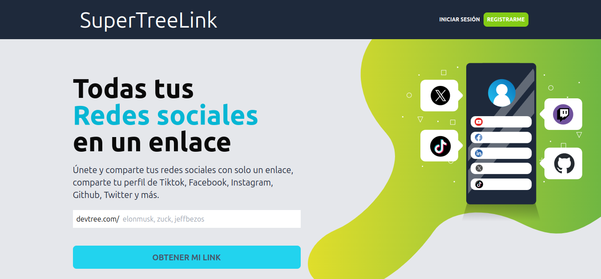
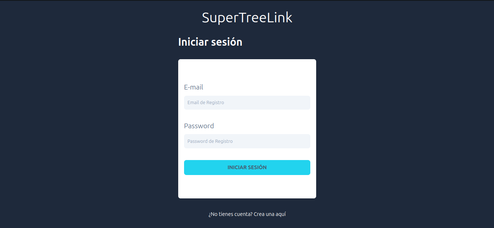
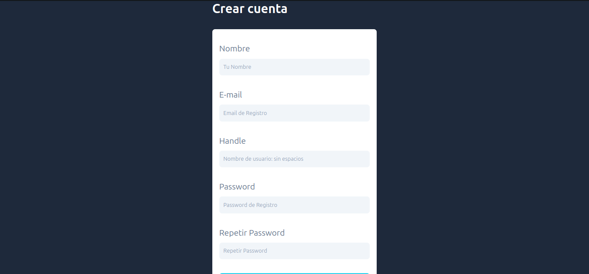
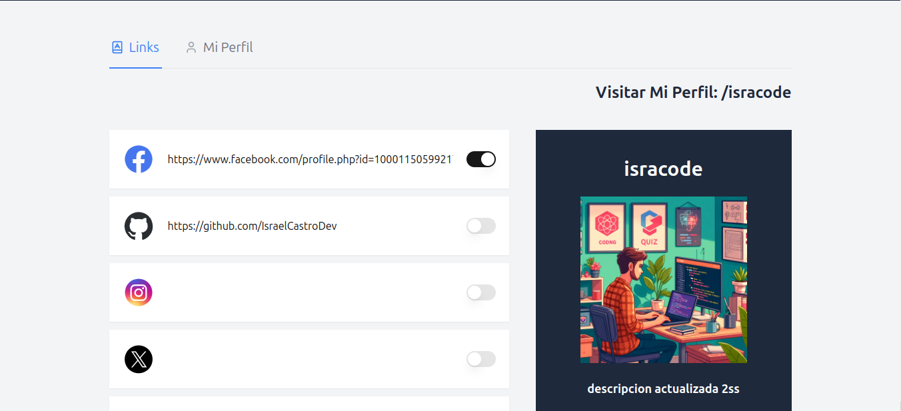
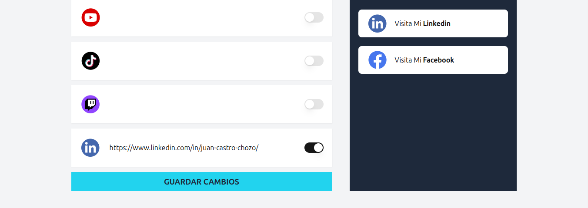
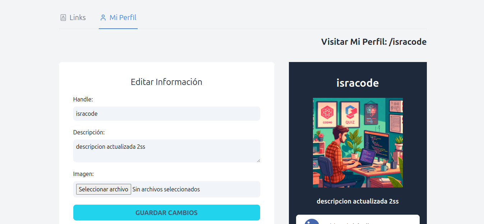
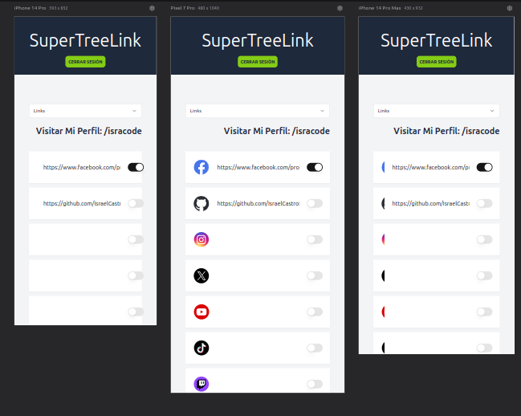

# 🌐 Clon de Linktree (SuperTreeLink)

Este proyecto es un clon de Linktree, desarrollado utilizando **Express** en el backend, **React** en el frontend y **MongoDB** como base de datos. Linktree permite a los usuarios agrupar múltiples enlaces en una sola página personalizada para compartir fácilmente.


## ✨ Características

- **Autenticación:** Inicio de sesión y registro para gestionar la página de enlaces.
  
  
- **Página de usuario personalizada:** Los usuarios pueden crear su propia página con enlaces personalizados.
  
  
- **Administración de perfil:** Los usuarios pueden editar su información de su cuenta.
  
- **Diseño responsivo:** La aplicación es completamente funcional en dispositivos móviles y de escritorio.
  

## 🛠️ Tecnologías utilizadas

### 🌐 Frontend

- React con TypeScript
- TailwindCSS (para estilos)
- Axios (para llamadas al backend)
- Shadcn (colección de componentes)

### 🔧 Backend

- Express con TypeScript
- MongoDB (para almacenamiento de datos)
- JWT (para autenticación)

## ⚙️ Instalación y ejecución

Sigue los pasos a continuación para configurar y ejecutar el proyecto localmente.

### 📋 Prerrequisitos

- Node.js (v14 o superior)
- MongoDB (si es necesario para tu backend)

### 📂 Clonar el repositorio

```bash
git clone https://github.com/IsraelCastroDev/linktree-clone.git
cd tu_repositorio
```

### 🛠️ Configurar el backend

1. Ve a la carpeta `backend`.
2. Instala las dependencias:
   ```bash
   npm install
   ```
3. Configura las variables de entorno creando un archivo `.env` basado en el archivo `.env.example.backend`.
4. Inicia el servidor:
   ```bash
   npm run dev
   ```

### 🖥️ Configurar el frontend

1. Ve a la carpeta `frontend`.
2. Configura las variables de entorno creando un archivo `.env` basado en el archivo `.env.example.frontend`.
3. Instala las dependencias:
   ```bash
   npm install
   ```
4. Inicia la aplicación:
   ```bash
   npm run dev
   ```

### 🌍 Acceso

Una vez que ambos servidores estén en funcionamiento:

- Frontend: `http://localhost:5173`
- Backend: `http://localhost:4000` (o el puerto configurado)

## 👨‍💻 Autor

Desarrollado por [Israel Castro](https://github.com/IsraelCastroDev).
